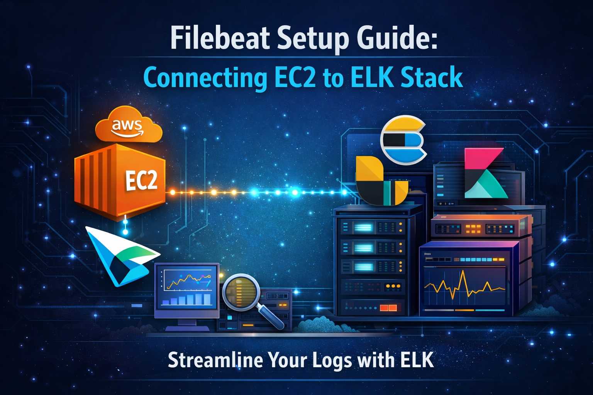
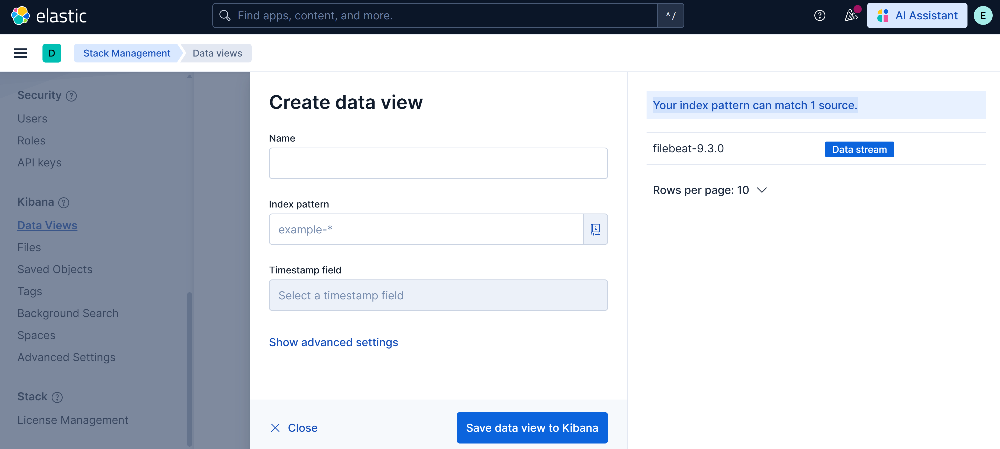
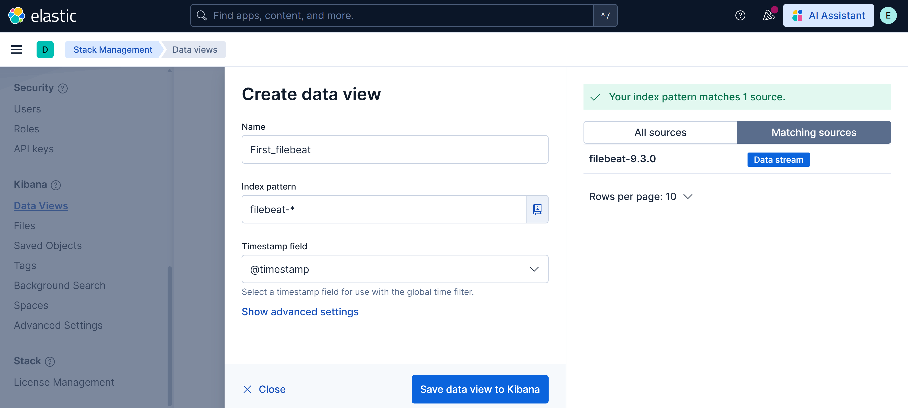
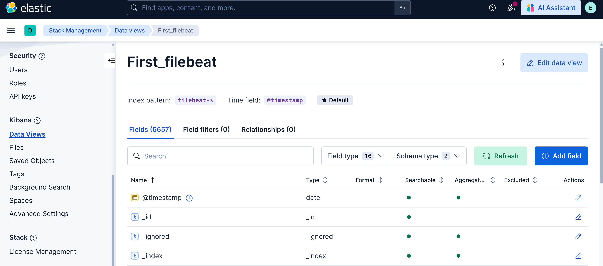

# Filebeat Setup Guide: Connecting EC2 to ELK Stack


## Overview

This guide walks you through setting up Filebeat on an EC2 instance and connecting it to an existing Elasticsearch and Kibana installation on a separate server. By the end of this guide, you'll have:

- Filebeat installed and running on an EC2 instance
- A demo application generating logs
- Filebeat configured to ship logs to your ELK server
- A data view created in Kibana to visualize your logs

---

## Prerequisites

Before starting, ensure you have:

- An ELK stack (Elasticsearch, Logstash, Kibana) already installed and running on a server
- A separate EC2 instance where you'll install Filebeat
- SSH access to both servers
- The IP address of your ELK server
- Elasticsearch credentials (username and password)
- Network connectivity between the two servers (ensure security groups/firewall rules allow traffic)

---

## Step 1: Install Filebeat on EC2

Connect to your EC2 instance via SSH and run the following commands:

### 1.1 Add Elastic Repository GPG Key

```bash
wget -qO - https://artifacts.elastic.co/GPG-KEY-elasticsearch | sudo apt-key add -
```

### 1.2 Install HTTPS Transport Package

```bash
sudo apt-get install apt-transport-https
```

### 1.3 Add Elastic Repository to APT Sources

```bash
echo "deb https://artifacts.elastic.co/packages/9.x/apt stable main" | sudo tee -a /etc/apt/sources.list.d/elastic-9.x.list
```

### 1.4 Update Package List and Install Filebeat

```bash
sudo apt-get update && sudo apt-get install filebeat
```

### 1.5 Enable and Start Filebeat Service

```bash
sudo systemctl enable --now filebeat
```

**Verify Installation:**

```bash
sudo systemctl status filebeat
```

You should see the service is active and running.

---

## Step 2: Generate Fake Logs for Testing

To test the setup, we'll create a simple application that generates logs.

### 2.1 Create Log Directory and File

```bash
sudo mkdir -p /var/log/demo-app
sudo touch /var/log/demo-app/app.log
sudo chmod 777 -R /var/log/demo-app
```

### 2.2 Create Log Generator Script

```bash
cat <<EOF > log-generator.sh
#!/bin/bash
while true
do
  echo "\$(date) | level=INFO | user=user\$RANDOM | action=login | status=success" >> /var/log/demo-app/app.log
  echo "\$(date) | level=ERROR | user=user\$RANDOM | action=payment | status=failed" >> /var/log/demo-app/app.log
  sleep 2
done
EOF
```

### 2.3 Run the Log Generator in Background

```bash
bash log-generator.sh &
```

**Verify Logs Are Being Generated:**

```bash
tail -f /var/log/demo-app/app.log
```

You should see new log entries appearing every 2 seconds. Press `Ctrl+C` to stop viewing.

### 2.4 (Optional) Stop the Log Generator

If you need to stop the log generator later:

1. List background jobs:
   ```bash
   jobs
   ```
   
   Output will show something like:
   ```
   [1]+  Running   bash log-generator.sh &
   ```

2. Bring it to foreground:
   ```bash
   fg %1
   ```

3. Stop it with `Ctrl+C`

---

## Step 3: Configure Filebeat

Now we'll configure Filebeat to read logs from our demo app and send them to Elasticsearch.

### 3.1 Edit Filebeat Configuration

```bash
sudo vi /etc/filebeat/filebeat.yml
```

> **Tip:** If you're not familiar with `vi`, you can use `nano` instead:
> ```bash
> sudo nano /etc/filebeat/filebeat.yml
> ```

### 3.2 Configure Filebeat Inputs

Locate the `filebeat.inputs:` section and replace it with:

```yaml
filebeat.inputs:
- type: filestream
  id: demo-app-logs
  enabled: true
  paths:
    - /var/log/demo-app/*.log
```

**Explanation:**
- `type: filestream` - Uses the filestream input type (recommended for log files)
- `id` - Unique identifier for this input
- `enabled: true` - Activates this input
- `paths` - Specifies which log files to monitor

### 3.3 Configure Kibana Connection

Locate the `setup.kibana:` section and configure it:

```yaml
setup.kibana:
  host: "https://<YOUR-ELK-SERVER-IP>:5601"
  username: "elastic"
  password: "<YOUR-KIBANA-PASSWORD>"
  ssl.verification_mode: none
```

**Replace:**
- `<YOUR-ELK-SERVER-IP>` - with your actual ELK server IP address (e.g., `172.31.23.242`)
- `<YOUR-KIBANA-PASSWORD>` - with your actual Kibana password

> ⚠️ **Security Note:** `ssl.verification_mode: none` disables SSL certificate verification. This is acceptable for testing but should be properly configured for production environments.

### 3.4 Configure Elasticsearch Output

Locate the `output.elasticsearch:` section and configure it:

```yaml
output.elasticsearch:
  hosts: ["<YOUR-ELK-SERVER-IP>:9200"]
  preset: balanced
  protocol: "https"
  username: "elastic"
  password: "<YOUR-KIBANA-PASSWORD>"
  ssl.verification_mode: none
```

**Replace:**
- `<YOUR-ELK-SERVER-IP>` - with your ELK server IP address
- `<YOUR-KIBANA-PASSWORD>` - with your Kibana password

**Explanation:**
- `hosts` - Elasticsearch server address(es)
- `preset: balanced` - Balances between performance and reliability
- `protocol: "https"` - Uses secure HTTPS connection
- `ssl.verification_mode: none` - Disables SSL verification (for testing)

### 3.5 Save and Exit

If using `vi`:
1. Press `Esc`
2. Type `:wq`
3. Press `Enter`

If using `nano`:
1. Press `Ctrl+X`
2. Press `Y` to confirm
3. Press `Enter`

---

## Step 4: Validate Configuration

Before restarting Filebeat, verify that everything is configured correctly.

### 4.1 Verify ELK Server is Running

On your ELK server, check Elasticsearch status:

```bash
sudo systemctl status elasticsearch
```

Ensure it shows `active (running)`.

### 4.2 Test Filebeat Configuration

On your Filebeat EC2 instance:

```bash
sudo filebeat test config
```

**Expected Output:**
```
Config OK
```

### 4.3 Test Elasticsearch Connection

```bash
sudo filebeat test output
```

**Expected Output:**
```
elasticsearch: https://<your-elk-server-ip>:9200...
  parse url... OK
  connection...
    parse host... OK
    dns lookup... OK
    addresses: <your-elk-server-ip>
    dial up... OK
  TLS...
    security... WARN server's certificate chain verification is disabled
    handshake... OK
    TLS version: TLSv1.3
    dial up... OK
  talk to server... OK
  version: 9.3.0
```

> **Note:** The warning about disabled certificate verification is expected based on our configuration.

### 4.4 Restart Filebeat

If both tests pass, restart Filebeat:

```bash
sudo systemctl restart filebeat
```

### 4.5 Check Filebeat Status

```bash
sudo systemctl status filebeat
```

Ensure it's active and running without errors.

---

## Step 5: Verify Data in Elasticsearch

### 5.1 Check Filebeat Index on ELK Server

SSH into your ELK server and run:

```bash
curl -k -u elastic https://localhost:9200/_cat/indices?v | grep filebeat
```

When prompted, enter your Elasticsearch password.

**Expected Output:**
```
yellow open .ds-filebeat-9.3.0-2026.02.04-000001  rYzNt2bESdC-TthmVbTm7Q  1  1  3106  0  757.9kb  757.9kb  757.9kb
```

**Explanation:**
- This shows that Filebeat has successfully created an index in Elasticsearch
- The index name follows the pattern `.ds-filebeat-VERSION-DATE-SEQUENCE`
- The document count (3106 in this example) shows logs are being ingested

> **Tip:** If you don't see any filebeat indices, wait a few minutes and try again. Also check Filebeat logs: `sudo journalctl -u filebeat -f`

---

## Step 6: Create Data View in Kibana

Now we'll set up Kibana to visualize the logs.

### 6.1 Access Kibana

Open your web browser and navigate to:

```
https://<YOUR-ELK-SERVER-IP>:5601
```

Login with your Elasticsearch credentials:
- Username: `elastic`
- Password: `<YOUR-KIBANA-PASSWORD>`

### 6.2 Navigate to Data Views

1. Click the **hamburger menu icon** (☰) in the top-left corner
2. Scroll down to the bottom of the menu
3. Find and click **"Stack Management"**
4. In the left sidebar under the **Kibana** section, click **"Data Views"**

### 6.3 Create a New Data View

1. Click the **"Create data view"** button
2. On the right side, you should see a message: **"Your index pattern can match 1 source"**
3. This confirms that Kibana can see your **filebeat-9.3.0** Data Stream



### 6.4 Configure the Data View

Fill in the following fields:

- **Name:** `Filebeat Logs` (or any descriptive name you prefer)
- **Index pattern:** `filebeat-*`
  
  This pattern will match all Filebeat indices, including future ones.

- **Timestamp field:** Select `@timestamp` from the dropdown



### 6.5 Save the Data View

Click **"Save data view to Kibana"**


---

## Step 7: View Your Logs in Kibana

### 7.1 Navigate to Discover

1. Click the hamburger menu (☰) in the top-left
2. Under **Analytics**, click **"Discover"**

### 7.2 Select Your Data View

1. In the top-left, click the data view dropdown
2. Select **"Filebeat Logs"** (or whatever you named it)

### 7.3 Explore Your Logs

You should now see your demo application logs appearing in Kibana! You can:

- **Filter logs** by level (INFO, ERROR)
- **Search** for specific users or actions
- **Create visualizations** and dashboards
- **Set time ranges** to view logs from specific periods


---

## Troubleshooting

### Problem: No filebeat indices in Elasticsearch

**Solutions:**
1. Check Filebeat service status: `sudo systemctl status filebeat`
2. View Filebeat logs: `sudo journalctl -u filebeat -f`
3. Verify network connectivity: `ping <ELK-SERVER-IP>`
4. Check firewall rules on both servers
5. Verify Elasticsearch is running: `sudo systemctl status elasticsearch`

### Problem: Connection refused when testing output

**Solutions:**
1. Verify Elasticsearch is listening on port 9200: `sudo netstat -tlnp | grep 9200`
2. Check if firewall allows traffic on port 9200
3. Verify the IP address in `filebeat.yml` is correct
4. Ensure security groups (AWS) allow traffic between instances

### Problem: Authentication failed

**Solutions:**
1. Verify username and password in `filebeat.yml`
2. Test credentials manually: `curl -k -u elastic:PASSWORD https://ELK-IP:9200`
3. Reset Elasticsearch password if needed

### Problem: Logs not appearing in Kibana

**Solutions:**
1. Verify the log generator script is running: `jobs`
2. Check if logs are being written: `tail -f /var/log/demo-app/app.log`
3. Verify the file path in `filebeat.yml` matches the actual log location
4. Check file permissions: `ls -la /var/log/demo-app/`
5. Restart Filebeat: `sudo systemctl restart filebeat`

---

## Security Best Practices for Production

This guide uses simplified security settings for demonstration purposes. For production environments, consider:

1. **SSL Certificate Verification**
   - Enable proper SSL certificate verification
   - Use valid SSL certificates
   - Set `ssl.verification_mode: full`

2. **Credentials Management**
   - Use Kibana keystore for sensitive information
   - Implement role-based access control (RBAC)
   - Rotate passwords regularly

3. **Network Security**
   - Use VPNs or private networks
   - Implement proper firewall rules
   - Enable TLS/SSL encryption

4. **File Permissions**
   - Set appropriate permissions on log files (not 777)
   - Use dedicated user accounts
   - Limit read/write access

---

## Summary

You've successfully:

Installed Filebeat on an EC2 instance  
Created a demo application generating logs  
Configured Filebeat to ship logs to Elasticsearch  
Verified the connection and data flow  
Created a data view in Kibana  
Viewed logs in Kibana's Discover interface  

You can now use this setup as a foundation for monitoring real applications by:
- Pointing Filebeat to your actual application logs
- Adding additional log paths
- Creating custom parsers and processors
- Building dashboards and visualizations in Kibana

---

## Additional Resources

- [Filebeat Official Documentation](https://www.elastic.co/guide/en/beats/filebeat/current/index.html)
- [Elasticsearch Documentation](https://www.elastic.co/guide/en/elasticsearch/reference/current/index.html)
- [Kibana User Guide](https://www.elastic.co/guide/en/kibana/current/index.html)
- [Elastic Security Best Practices](https://www.elastic.co/guide/en/elasticsearch/reference/current/security-basic-setup.html)

---
