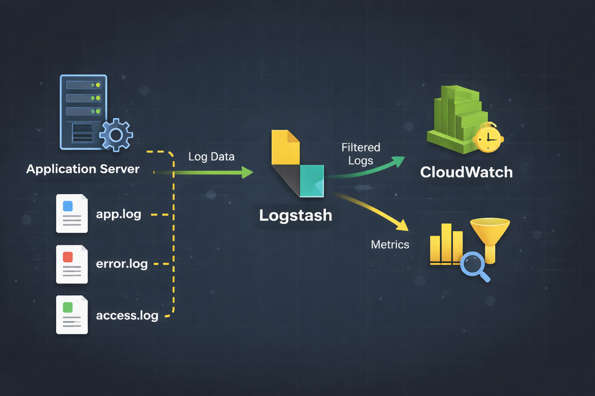
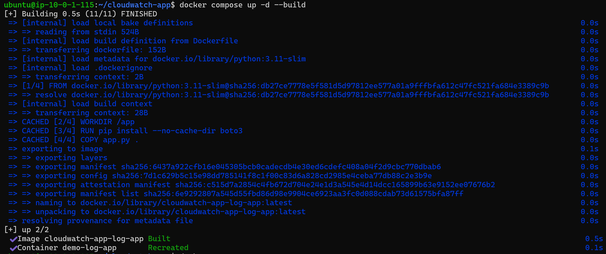
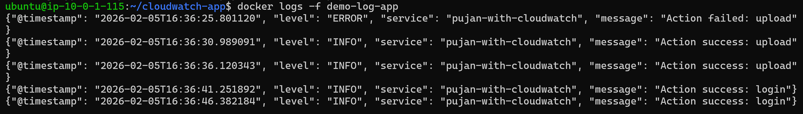
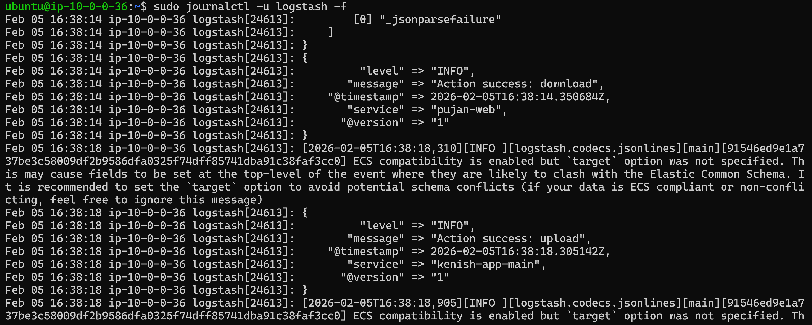
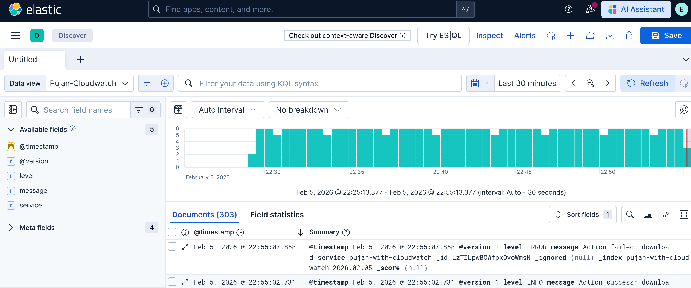
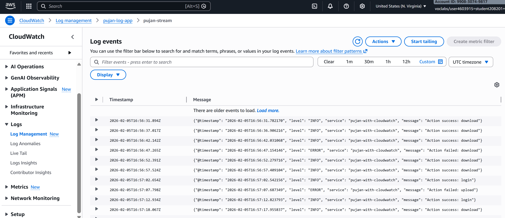

# Application Server Logs to Logstash and CloudWatch

## Overview

This guide will help you set up a logging system that sends application logs to both **Logstash (ELK Stack)** and **AWS CloudWatch**. This dual-logging approach ensures redundancy and provides flexible log analysis options.



### What You'll Need

- **2 Servers:**
  - **App Server** - Where your application runs
  - **ELK Server** - Where Logstash, Elasticsearch, and Kibana run
- **AWS Account** with access credentials
- **Basic knowledge** of Docker and command line

---

## Architecture

```
┌─────────────────┐
│   App Server    │
│                 │
│  ┌───────────┐  │
│  │Python App │  │
│  │ (Docker)  │  │
│  └─────┬─────┘  │
│        │        │
│        ├────────┼──────────► Logstash (ELK Server)
│        │        │
│        └────────┼──────────► AWS CloudWatch
│                 │
└─────────────────┘
```

---

## Part 1: Application Server Setup

### Step 1: Install AWS CLI

The AWS CLI allows your application to send logs to CloudWatch.

```bash
# Install unzip utility
sudo apt-get install unzip

# Download AWS CLI
curl "https://awscli.amazonaws.com/awscli-exe-linux-x86_64.zip" -o "awscliv2.zip"

# Unzip the installer
unzip awscliv2.zip

# Install AWS CLI
sudo ./aws/install
```

**Verify Installation:**
```bash
aws --version
```

You should see output like: `aws-cli/2.x.x ...`

---

### Step 2: Configure AWS Credentials

Create the AWS credentials directory and file:

```bash
# Create AWS config directory
mkdir -p ~/.aws

# Create credentials file
vi ~/.aws/credentials
```

**Add your credentials** (replace with your actual credentials):

```ini
[default]
aws_access_key_id = YOUR_ACCESS_KEY_ID
aws_secret_access_key = YOUR_SECRET_ACCESS_KEY
aws_session_token = YOUR_SESSION_TOKEN
```

**Configure AWS CLI:**

```bash
aws configure
```

You'll be prompted to enter:
- **AWS Access Key ID**: Press Enter (already in credentials file)
- **AWS Secret Access Key**: Press Enter (already in credentials file)
- **AWS Session Token**: Press Enter (already in credentials file)
- **Default region name**: Enter your region (e.g., `us-east-1`)
- **Default output format**: Press Enter (leave as default)

---

### Step 3: Create Application Files

#### 3.1 Create Project Directory

```bash
mkdir cloudwatch-app
cd cloudwatch-app
```

#### 3.2 Create Dockerfile

```bash
vi Dockerfile
```

**Paste the following content:**

```dockerfile
FROM python:3.11-slim
WORKDIR /app
RUN pip install --no-cache-dir boto3
COPY app.py .
CMD ["python", "app.py"]
```

**What this does:**
- Uses Python 3.11 base image
- Installs `boto3` (AWS SDK for Python)
- Copies your application code
- Runs the Python app

#### 3.3 Create Application Code

```bash
vi app.py
```

**Paste the following content:**

```python
import json
import random
import time
import socket
import sys
import os
import boto3
from datetime import datetime
from botocore.exceptions import ClientError

# ----------------------------
# Logstash Configuration
# ----------------------------
LOGSTASH_HOST = os.getenv("LOGSTASH_HOST", "logstash")
LOGSTASH_PORT = int(os.getenv("LOGSTASH_PORT", 5044))

# ----------------------------
# CloudWatch Configuration
# ----------------------------
AWS_REGION = os.getenv("AWS_REGION", "us-east-1")
LOG_GROUP = os.getenv("CW_LOG_GROUP", "pujan-log-app")
LOG_STREAM = os.getenv("CW_LOG_STREAM", "pujan-stream")

logs_client = boto3.client("logs", region_name=AWS_REGION)
sequence_token = None

def init_cloudwatch():
    """Ensure log group and stream exist"""
    global sequence_token
    
    # Create log group if it doesn't exist
    try:
        logs_client.create_log_group(logGroupName=LOG_GROUP)
    except ClientError as e:
        if e.response["Error"]["Code"] != "ResourceAlreadyExistsException":
            raise
    
    # Create log stream if it doesn't exist
    try:
        logs_client.create_log_stream(
            logGroupName=LOG_GROUP,
            logStreamName=LOG_STREAM
        )
    except ClientError as e:
        if e.response["Error"]["Code"] != "ResourceAlreadyExistsException":
            raise
    
    # Fetch sequence token if stream already exists
    streams = logs_client.describe_log_streams(
        logGroupName=LOG_GROUP,
        logStreamNamePrefix=LOG_STREAM
    )
    if streams["logStreams"]:
        sequence_token = streams["logStreams"][0].get("uploadSequenceToken")

def send_to_cloudwatch(log):
    """Send log event to CloudWatch Logs"""
    global sequence_token
    
    event = {
        "timestamp": int(time.time() * 1000),
        "message": json.dumps(log)
    }
    
    kwargs = {
        "logGroupName": LOG_GROUP,
        "logStreamName": LOG_STREAM,
        "logEvents": [event]
    }
    
    if sequence_token:
        kwargs["sequenceToken"] = sequence_token
    
    try:
        response = logs_client.put_log_events(**kwargs)
        sequence_token = response["nextSequenceToken"]
    except ClientError as e:
        print(f"CloudWatch send failed: {e}", file=sys.stderr)

def send_to_logstash(log):
    """Send log event to Logstash"""
    try:
        sock = socket.socket(socket.AF_INET, socket.SOCK_STREAM)
        sock.connect((LOGSTASH_HOST, LOGSTASH_PORT))
        sock.sendall((json.dumps(log) + "\n").encode("utf-8"))
        sock.close()
    except Exception as e:
        print(f"Logstash send failed: {e}", file=sys.stderr)

# ----------------------------
# Main Application Loop
# ----------------------------
init_cloudwatch()

while True:
    # Generate random log entry
    level = random.choice(["INFO", "ERROR"])
    action = random.choice(["login", "upload", "download"])
    
    log = {
        "@timestamp": datetime.utcnow().isoformat(),
        "level": level,
        "service": "pujan-with-cloudwatch",
        "message": f"Action {'failed' if level == 'ERROR' else 'success'}: {action}"
    }
    
    # Print to stdout (visible in Docker logs)
    print(json.dumps(log), flush=True)
    
    # Send to Logstash
    send_to_logstash(log)
    
    # Send to CloudWatch
    send_to_cloudwatch(log)
    
    # Wait 5 seconds before next log
    time.sleep(5)
```

**What this application does:**
- Generates random log entries every 5 seconds
- Sends logs to **three destinations**:
  1. Docker logs (stdout)
  2. Logstash server
  3. AWS CloudWatch

#### 3.4 Create Docker Compose File

```bash
vi docker-compose.yaml
```

**Paste the following content:**

```yaml
services:
  log-app:
    build: .
    container_name: demo-log-app
    volumes:
      - ~/.aws:/root/.aws:ro
    environment:
      AWS_REGION: us-east-1
      CW_LOG_GROUP: pujan-log-app
      CW_LOG_STREAM: pujan-stream
      LOGSTASH_HOST: elk.tekbay.click      # Replace with your ELK server hostname/IP
      LOGSTASH_PORT: 5044
```

**⚠️ Important:** Replace `elk.tekbay.click` with your actual ELK server hostname or IP address.

---

### Step 4: Build and Run the Application

```bash
# Build and start the container
docker compose up -d --build
```

**What happens:**
- Docker builds the image from your Dockerfile
- Container starts in detached mode (`-d`)
- Application begins sending logs



---

### Step 5: Verify Application Logs

Check that your application is running and generating logs:

```bash
docker logs -f demo-log-app
```

**Expected output:**
```json
{"@timestamp": "2026-02-05T10:30:15.123456", "level": "INFO", "service": "pujan-with-cloudwatch", "message": "Action success: login"}
{"@timestamp": "2026-02-05T10:30:20.234567", "level": "ERROR", "service": "pujan-with-cloudwatch", "message": "Action failed: upload"}
```

Press `Ctrl+C` to stop viewing logs.


---

## Part 2: ELK Server Setup

### Step 1: Configure Logstash

Navigate to Logstash configuration directory:

```bash
cd /etc/logstash/conf.d
```

Create a new configuration file:

```bash
sudo vi test.conf
```

**Paste the following configuration:**

```ruby
input {
  tcp {
    port => 5044
    codec => json
  }
}

output {
  if [service] == "shahid" {
    elasticsearch {
      hosts => ["https://localhost:9200"]
      user => "elastic"
      password => "P@ssw0rd01"
      ssl_enabled => true
      ssl_certificate_authorities => "/etc/logstash/certs/http_ca.crt"
      index => "logstash-shahid-%{+YYYY.MM.dd}"
    }
  } else if [service] == "pujan" {
    elasticsearch {
      hosts => ["https://localhost:9200"]
      user => "elastic"
      password => "P@ssw0rd01"
      ssl_enabled => true
      ssl_certificate_authorities => "/etc/logstash/certs/http_ca.crt"
      index => "logstash-pujan-%{+YYYY.MM.dd}"
    }
  } else if [service] == "yaman" {
    elasticsearch {
      hosts => ["https://localhost:9200"]
      user => "elastic"
      password => "P@ssw0rd01"
      ssl_enabled => true
      ssl_certificate_authorities => "/etc/logstash/certs/http_ca.crt"
      index => "logstash-yaman-%{+YYYY.MM.dd}"
    }
  } else if [service] == "ribesh" {
    elasticsearch {
      hosts => ["https://localhost:9200"]
      user => "elastic"
      password => "P@ssw0rd01"
      ssl_enabled => true
      ssl_certificate_authorities => "/etc/logstash/certs/http_ca.crt"
      index => "logstash-ribesh-%{+YYYY.MM.dd}"
    }
  } else if [service] == "ribesh-with-cloudwatch" {
    elasticsearch {
      hosts => ["https://localhost:9200"]
      user => "elastic"
      password => "P@ssw0rd01"
      ssl_enabled => true
      ssl_certificate_authorities => "/etc/logstash/certs/http_ca.crt"
      index => "logstash-ribesh-with-cloudwatch-%{+YYYY.MM.dd}"
    }
  } else if [service] == "kenish-app-main" {
    elasticsearch {
      hosts => ["https://localhost:9200"]
      user => "elastic"
      password => "P@ssw0rd01"
      ssl_enabled => true
      ssl_certificate_authorities => "/etc/logstash/certs/http_ca.crt"
      index => "logstash-kenish-%{+YYYY.MM.dd}"
    }
  } else if [service] == "pujan-with-cloudwatch" {
    elasticsearch {
      hosts => ["https://localhost:9200"]
      user => "elastic"
      password => "P@ssw0rd01"
      ssl_enabled => true
      ssl_certificate_authorities => "/etc/logstash/certs/http_ca.crt"
      index => "pujan-with-cloudwatch-%{+YYYY.MM.dd}"
    }
  }
  
  stdout { codec => rubydebug }
}
```

**What this configuration does:**
- **Input**: Listens on port 5044 for JSON-formatted logs
- **Output**: Routes logs to different Elasticsearch indices based on the `service` field
- Creates daily indices (e.g., `pujan-with-cloudwatch-2026.02.05`)
- Also outputs to stdout for debugging

**⚠️ Important:** Update the Elasticsearch password (`P@ssw0rd01`) to match your actual setup.

---

### Step 2: Restart Logstash

After saving the configuration file, restart Logstash:

```bash
sudo systemctl restart logstash
```

---

### Step 3: Verify Logstash is Receiving Logs

Monitor Logstash logs in real-time:

```bash
sudo journalctl -u logstash -f
```

**What to look for:**
- JSON-formatted log entries appearing
- No error messages about connections or parsing
- Logs matching the structure from your application

**Example output:**
```
{
    "@timestamp" => "2026-02-05T10:30:15.123456",
         "level" => "INFO",
       "service" => "pujan-with-cloudwatch",
       "message" => "Action success: login"
}
```

Press `Ctrl+C` to stop viewing logs.


---

## Part 3: Kibana Visualization

### Step 1: Access Kibana

Open your web browser and navigate to your Kibana URL (e.g., `https://your-elk-server:5601`)

Log in with your Elasticsearch credentials.

---

### Step 2: Create Data View

1. Click the **hamburger menu** (☰) in the top-left corner
2. Scroll down to the bottom section
3. Click **Stack Management**
4. In the left sidebar under "Kibana", click **Data Views**
5. Click **Create data view** button

**Configure the data view:**
- **Name**: `Pujan CloudWatch Logs` (or any descriptive name)
- **Index pattern**: `pujan-with-cloudwatch-*`
- **Timestamp field**: `@timestamp`
- Click **Save data view to Kibana**

---

### Step 3: View Logs in Discover

1. Click the **hamburger menu** (☰) in the top-left corner
2. Under "Analytics" (near the top), click **Discover**
3. In the top-left, next to "Data view", select your newly created data view
4. You should now see your logs!

**What you can do:**
- **Search**: Use the search bar to filter logs
- **Time range**: Adjust the time picker (top-right) to view different time periods
- **Fields**: Click on fields in the left sidebar to add them to the view
- **Visualize**: Create charts and dashboards from your log data


---

## Part 4: AWS CloudWatch Verification

### Step 1: Access CloudWatch

1. Log in to **AWS Console**
2. Search for and click **CloudWatch**

---

### Step 2: Navigate to Log Groups

1. In the left sidebar, under "Logs", click **Log groups**
2. Find and click your log group: `pujan-log-app`

---

### Step 3: View Log Stream

1. Click on your log stream: `pujan-stream`
2. You'll see all log events displayed

**What you can do:**
- **Search**: Use the search bar to filter specific log entries
- **Time range**: Select different time ranges
- **Export**: Export logs for analysis
- **Create metrics**: Create CloudWatch metrics from log patterns
- **Set alarms**: Create alarms based on log patterns (e.g., alert when ERROR count exceeds threshold)


---

## Troubleshooting

### Issue: Logs not appearing in Logstash

**Check:**
1. Verify Logstash is running: `sudo systemctl status logstash`
2. Check firewall allows port 5044: `sudo ufw status`
3. Verify correct hostname/IP in `docker-compose.yaml`
4. Check Logstash logs: `sudo journalctl -u logstash -xe`

---

### Issue: Logs not appearing in CloudWatch

**Check:**
1. Verify AWS credentials are correct: `aws sts get-caller-identity`
2. Check IAM permissions (need `logs:CreateLogGroup`, `logs:CreateLogStream`, `logs:PutLogEvents`)
3. Check Docker container logs: `docker logs demo-log-app`
4. Verify correct AWS region in `docker-compose.yaml`

---

### Issue: Cannot connect to Elasticsearch in Kibana

**Check:**
1. Verify Elasticsearch is running: `sudo systemctl status elasticsearch`
2. Check Elasticsearch password is correct
3. Verify SSL certificate path: `/etc/logstash/certs/http_ca.crt`

---

## Summary

You now have a complete dual-logging setup:

✅ **Application Server** generates logs  
✅ **Logstash** receives and indexes logs in Elasticsearch  
✅ **Kibana** visualizes logs with powerful search and dashboards  
✅ **CloudWatch** stores logs for AWS-native monitoring and alerting  

This setup provides:
- **Redundancy**: Logs in two separate systems
- **Flexibility**: Use Kibana for detailed analysis, CloudWatch for AWS integration
- **Scalability**: Add more services by extending the Logstash configuration

---

## Next Steps

### Add More Services

To add another service, modify the Logstash configuration:

```ruby
else if [service] == "your-new-service" {
  elasticsearch {
    hosts => ["https://localhost:9200"]
    user => "elastic"
    password => "P@ssw0rd01"
    ssl_enabled => true
    ssl_certificate_authorities => "/etc/logstash/certs/http_ca.crt"
    index => "logstash-your-new-service-%{+YYYY.MM.dd}"
  }
}
```

### Create CloudWatch Alarms

1. Go to CloudWatch → Alarms
2. Create alarm based on log patterns
3. Set up SNS notifications for critical errors

### Build Kibana Dashboards

1. Use the Visualize feature to create charts
2. Combine visualizations into dashboards
3. Share dashboards with your team

---

## Important Security Notes

- **Never commit AWS credentials** to version control
- **Use IAM roles** instead of access keys when possible
- **Rotate credentials** regularly
- **Use strong passwords** for Elasticsearch
- **Enable SSL/TLS** for all connections in production

---
