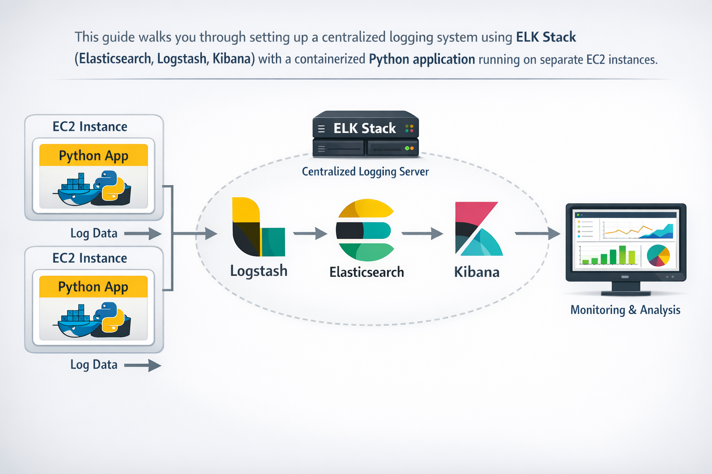
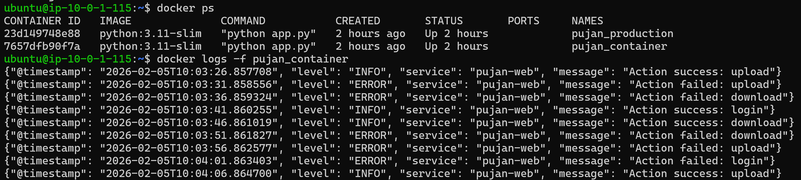
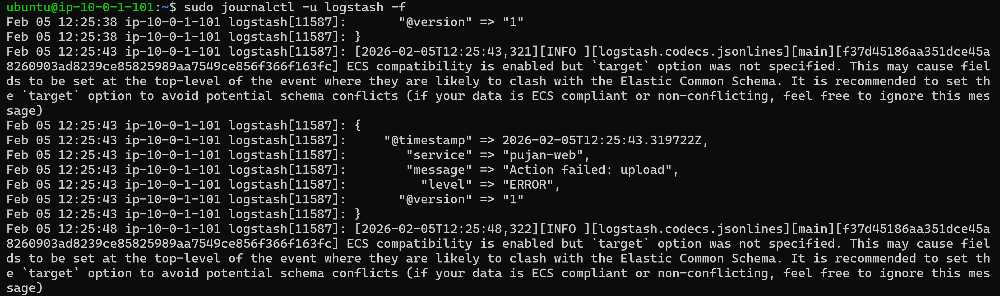
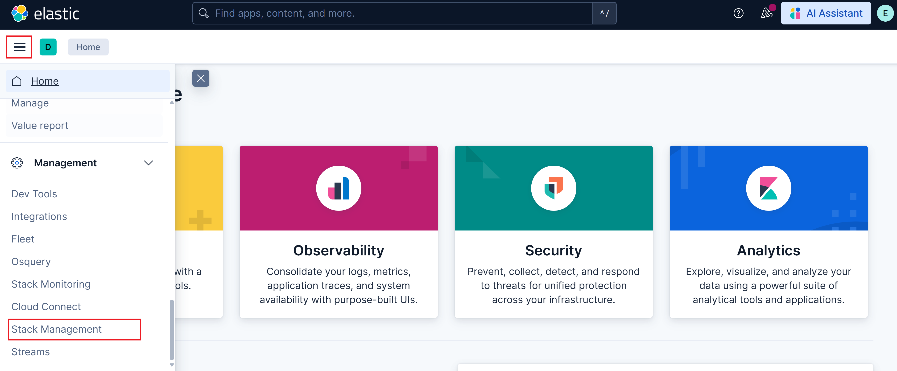
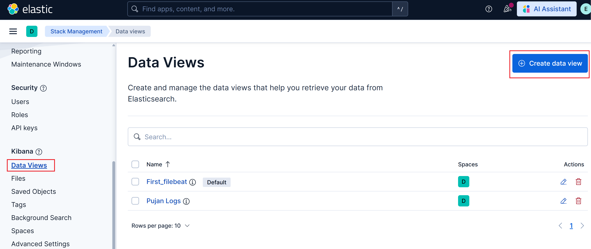
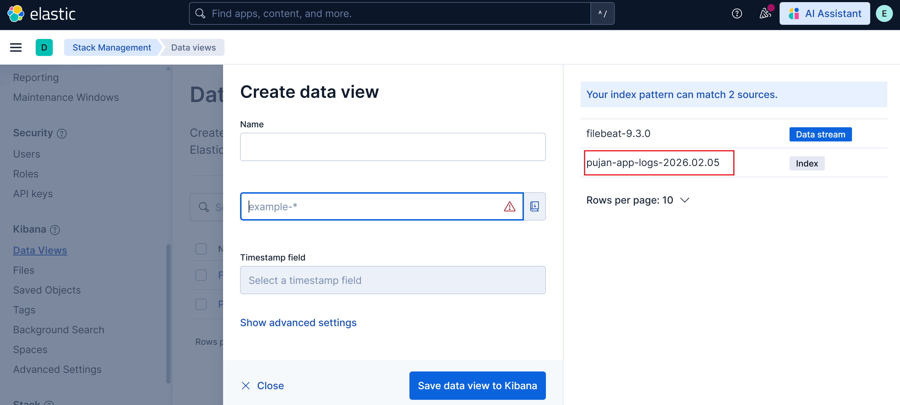
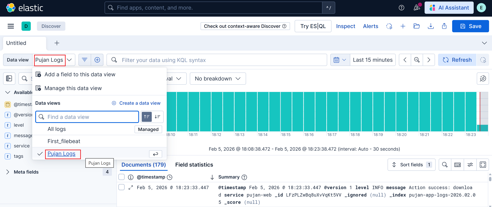

# ELK Stack Logging Setup Guide

## Complete Guide to Setting Up Application Logging with ELK Stack

This guide walks you through setting up a centralized logging system using ELK Stack (Elasticsearch, Logstash, Kibana) with a containerized Python application running on separate EC2 instances.

---


## Table of Contents

1. [Architecture Overview](#architecture-overview)
2. [Prerequisites](#prerequisites)
3. [Understanding the Application](#understanding-the-application)
4. [Part 1: Application Container Setup](#part-1-application-container-setup)
5. [Part 2: ELK Server Configuration](#part-2-elk-server-configuration)
6. [Part 3: Kibana Dashboard Setup](#part-3-kibana-dashboard-setup)
7. [Verification and Troubleshooting](#verification-and-troubleshooting)
8. [Best Practices](#best-practices)

---

## Architecture Overview

```
┌─────────────────────────┐          ┌─────────────────────────┐
│   EC2: App Container    │          │   EC2: ELK Container    │
│  ┌──────────────────┐   │          │  ┌──────────────────┐   │
│  │                  │   │   TCP    │  │    Logstash      │   │
│  │  Python App      │───┼──5044────┼─→│   (Port 5044)    │   │
│  │  (Docker)        │   │          │  │                  │   │
│  └──────────────────┘   │          │  └────────┬─────────┘   │
│                         │          │           │             │
└─────────────────────────┘          │  ┌────────▼─────────┐   │
                                     │  │  Elasticsearch   │   │
                                     │  │   (Port 9200)    │   │
                                     │  └────────┬─────────┘   │
                                     │           │             │
                                     │  ┌────────▼─────────┐   │
                                     │  │     Kibana       │   │
                                     │  │   (Port 5601)    │   │
                                     │  └──────────────────┘   │
                                     └─────────────────────────┘
                                              ▲
                                              │
                                        Browser Access
                                    http://<ip>:5601
```

**How it works:**
- The Python application sends logs via TCP to Logstash (port 5044)
- Logstash processes and forwards logs to Elasticsearch
- Kibana visualizes the data stored in Elasticsearch
- You access Kibana through your browser to view logs

---

## Prerequisites

### Required Components

✅ **ELK Server (elk-container EC2):**
- ELK Stack already installed and running
- Elasticsearch, Logstash, and Kibana services operational
- Kibana accessible at `http://<elk-ip>:5601` or `http://<domain>:5601`

✅ **Application Server (app-container EC2):**
- Docker installed
- Docker Compose installed
- Network access to ELK server on port 5044

### Network Requirements

- **If both EC2 instances are in the same VPC:** Use the ELK server's **private IP** (saves costs, more secure)
- **If in different VPCs or regions:** Use the ELK server's **public IP** or domain name
- **Security Groups:** Ensure port 5044 is open from app-container to elk-container

### Verify Prerequisites

On **app-container**:
```bash
# Check Docker installation
docker --version

# Check Docker Compose installation
docker compose version
```

On **elk-container**:
```bash
# Check Logstash is running
sudo systemctl status logstash

# Check Elasticsearch is running
curl -k -u elastic:admin123 https://localhost:9200

# Check Kibana is accessible
curl http://localhost:5601
```

---

## Understanding the Application

Before we begin, let's understand what the Python application does.

### What is `app.py`?

The `app.py` file is a simple Python application that:

1. **Generates mock log data** every 5 seconds with:
   - Random log levels (INFO or ERROR)
   - Random actions (login, upload, download)
   - Timestamps in ISO format
   - Service identification

2. **Sends logs to two destinations:**
   - **stdout** → viewable via `docker logs` command
   - **Logstash** → sent via TCP socket to ELK stack for centralized logging

3. **Uses a TCP socket connection** to transmit JSON-formatted logs to Logstash

**Example log output:**
```json
{
  "@timestamp": "2024-02-05T10:30:45.123456",
  "level": "INFO",
  "service": "pujan-app-main",
  "message": "Action success: login"
}
```

This dual-logging approach allows you to:
- View logs locally using Docker commands (useful for debugging)
- Centralize logs in ELK for analysis, searching, and long-term storage

---

## Part 1: Application Container Setup (in App-Server)

### Step 1: Connect to Your App Server

```bash
# SSH into your app-container EC2 instance
ssh -i your-key.pem ubuntu@<app-container-ip>
```

### Step 2: Create Project Directory

```bash
# Create a directory for the application
mkdir -p ~/logging-demo
cd ~/logging-demo
```

### Step 3: Create the Application File

Create the `app.py` file:

```bash
nano app.py
```

Paste the following code:

```python
import json
import random
import time
import socket
import sys
from datetime import datetime

# IMPORTANT: Change this to your ELK server's IP or domain
# Use PRIVATE IP if both EC2s are in the same VPC (recommended for cost savings)
# Use PUBLIC IP or domain if they're in different VPCs/regions
LOGSTASH_HOST = "<ip or domain name of your elk server>"  # ← CHANGE THIS
LOGSTASH_PORT = 5044  # Logstash TCP input port

def send_to_logstash(log):
    """
    Send log entry to Logstash via TCP socket
    """
    try:
        sock = socket.socket(socket.AF_INET, socket.SOCK_STREAM)
        sock.connect((LOGSTASH_HOST, LOGSTASH_PORT))
        sock.sendall((json.dumps(log) + "\n").encode("utf-8"))
        sock.close()
    except Exception as e:
        print(f"Logstash send failed: {e}", file=sys.stderr)

# Main loop: Generate and send logs continuously
while True:
    # Generate random log data
    level = random.choice(["INFO", "ERROR"])
    action = random.choice(["login", "upload", "download"])
    
    log = {
        "@timestamp": datetime.utcnow().isoformat(),
        "level": level,
        "service": "pujan-app-main",  # ← Change to your service name
        "message": f"Action {'failed' if level=='ERROR' else 'success'}: {action}"
    }
    
    # 1️⃣ Print to stdout (viewable with docker logs)
    print(json.dumps(log), flush=True)
    
    # 2️⃣ Send to Logstash (centralized logging)
    send_to_logstash(log)
    
    # Wait 5 seconds before next log
    time.sleep(5)
```

**Configuration notes:**
- **Line 10:** Replace `<ip or domain name of your elk server>` with your actual ELK server address
- **Line 11:** Port 5044 is the standard Logstash TCP input port
- **Line 37:** Customize `"pujan-app-main"` to your service name

Save and exit (Ctrl+X, then Y, then Enter).

### Step 4: Create Docker Compose File

Create the `docker-compose.yaml` file:

```bash
nano docker-compose.yaml
```

Paste the following:

```yaml
version: "3.9"

services:
  logdemo:
    image: python:3.11-slim
    container_name: pujan-container  # ← Change to your container name
    working_dir: /app
    volumes:
      - .:/app  # Mount current directory to /app in container
    command: python app.py
    restart: unless-stopped  # Auto-restart if container crashes
```

**What this does:**
- Uses official Python 3.11 slim image (lightweight)
- Names the container `pujan-container` (customize as needed)
- Mounts the current directory into the container
- Runs `app.py` automatically
- Restarts the container if it stops unexpectedly

Save and exit.

### Step 5: Start the Application Container

```bash
# Start the container in detached mode
docker compose up -d --build
```

Expected output:
```
[+] Building 2.3s (7/7) FINISHED
[+] Running 1/1
 ✔ Container pujan-container  Started
```

### Step 6: Verify the Application is Running

```bash
# Check container status
docker ps

# View live logs
docker logs -f pujan-container
```

You should see JSON logs appearing every 5 seconds:
```json
{"@timestamp": "2024-02-05T10:35:21.456789", "level": "INFO", "service": "pujan-app-main", "message": "Action success: upload"}
{"@timestamp": "2024-02-05T10:35:26.789012", "level": "ERROR", "service": "pujan-app-main", "message": "Action failed: login"}
```

Press `Ctrl+C` to stop viewing logs (container continues running).



---

## Part 2: ELK Server Configuration (in ELK-Server)

Now we'll configure Logstash on your ELK server to receive and process logs from the application.

### Step 1: Connect to Your ELK Server

```bash
# SSH into your elk-container EC2 instance
ssh -i your-key.pem ubuntu@<elk-container-ip>
```

### Step 2: Navigate to Logstash Configuration Directory

```bash
cd /etc/logstash/conf.d
```

### Step 3: Create Logstash Pipeline Configuration

Create a new configuration file:

```bash
sudo nano app-logs.conf
```

Paste the following configuration:

```ruby
# INPUT: Receive logs from application via TCP
input {
  tcp {
    port => 5044         # Listen on port 5044
    codec => json        # Expect JSON-formatted logs
  }
}

# OUTPUT: Send to Elasticsearch and stdout
output {
  # Send to Elasticsearch
  elasticsearch {
    hosts => ["https://localhost:9200"]  # Elasticsearch endpoint
    user => "elastic"                     # ← Change to your username
    password => "admin123"                # ← Change to your password
    ssl_enabled => true
    ssl_certificate_authorities => "/etc/logstash/certs/http_ca.crt"
    index => "pujan-app-logs-%{+YYYY.MM.dd}"  # ← Customize index name
    # Creates daily indices: pujan-app-logs-2024.02.05, pujan-app-logs-2024.02.06, etc.
  }
  
  # Also output to console for debugging
  stdout { 
    codec => rubydebug 
  }
}
```

**Configuration notes:**
- **Line 14-15:** Update with your Elasticsearch credentials
- **Line 18:** Customize the index name pattern (currently creates daily indices)
- **Line 22-24:** Console output helps verify logs are being received

Save and exit.

### Step 4: Verify Logstash Configuration

```bash
# Test the configuration syntax
sudo /usr/share/logstash/bin/logstash -f /etc/logstash/conf.d/app-logs.conf --config.test_and_exit
```
Expected output:
```
Configuration OK
```

### Step 5: Restart Logstash Service

```bash
# Restart Logstash to apply new configuration
sudo systemctl restart logstash

# Check Logstash status
sudo systemctl status logstash
```

Expected status: `active (running)`

### Step 6: Monitor Logstash Logs

```bash
# View Logstash logs in real-time
sudo journalctl -u logstash -f
```

You should see JSON logs being received from your application:

```json
{
    "@timestamp" => 2024-02-05T10:40:15.123Z,
         "level" => "INFO",
       "service" => "pujan-app-main",
       "message" => "Action success: login",
          "host" => "172.31.10.50",
          "port" => 54321
}
```

This confirms Logstash is receiving logs from your application!

Press `Ctrl+C` to stop viewing logs.


---
### Step 7: Verify Data in Elasticsearch

```bash
# Check if indices are being created
curl -k -u elastic:admin123 https://localhost:9200/_cat/indices?v | grep pujan-app
```

Expected output:
```
green open pujan-app-logs-2024.02.05 1 1 245 0 156.3kb 78.1kb
```

This shows your index exists and is receiving data.

---

## Part 3: Kibana Dashboard Setup

Now we'll configure Kibana to visualize your application logs.

### Step 1: Access Kibana

Open your browser and navigate to:
```
http://<elk-server-ip>:5601
```
or
```
http://<your-domain>:5601
```

Log in with your Elasticsearch credentials:
- **Username:** `elastic`
- **Password:** `admin123` (or your password)

### Step 2: Navigate to Data Views

1. Click the **☰ hamburger menu** in the top-left corner
2. Scroll down to find **Management** section
3. Click **Stack Management**
4. In the left sidebar, scroll down to **Kibana** section
5. Click **Data Views**



### Step 3: Create a Data View

On the Data Views page:

1. Click **Create data view** button (top-right)

2. **Fill in the form:**
   - **Name:** `Pujan App Logs` (or your preferred name)
   - **Index pattern:** `pujan-app-logs-*` 
     - The `*` wildcard matches all daily indices (pujan-app-logs-2024.02.05, etc.)
     - You should see matching indices listed on the right side
   - **Timestamp field:** Select `@timestamp` from dropdown

3. Click **Save data view to Kibana**



### Step 4: Navigate to Discover

1. Click the **☰ hamburger menu** again
2. Under **Analytics** section (near the top)
3. Click **Discover**


### Step 5: Select Your Data View

1. In the top-left area, next to "Data view"
2. Click the **dropdown menu**
3. Select **Pujan App Logs** (the data view you just created)



### Step 6: Explore Your Logs

You should now see your application logs in the main panel!

**What you'll see:**
- **Timeline chart** showing log distribution over time
- **Log entries** with fields like `@timestamp`, `level`, `service`, `message`
- **Sidebar** with available fields you can filter by

### Step 7: Customize Your View (Optional)

**Add columns to the table:**
1. In the left sidebar, find fields like `level`, `service`, `message`
2. Hover over a field and click the **+** icon to add it as a column

**Filter logs:**
1. Click **+ Add filter** button
2. Select field (e.g., `level`)
3. Select operator (e.g., `is`)
4. Enter value (e.g., `ERROR`)
5. Click **Save**

**Adjust time range:**
1. Click the **time picker** in the top-right (shows current range)
2. Select predefined range (Last 15 minutes, Last 24 hours, etc.)
3. Or set a custom range

**Save your search:**
1. Click **Save** in the top menu
2. Give it a name like "App Error Logs"
3. Click **Save**

---

## Verification and Troubleshooting

### Verification Checklist

✅ **Application Container:**
```bash
# Container is running
docker ps | grep pujan-container

# Logs are being generated
docker logs -f pujan-container
```

✅ **Network Connectivity:**
```bash
# From app-container, test connection to Logstash
telnet <elk-server-ip> 5044
# Should connect successfully (Ctrl+], then type 'quit')
```

✅ **Logstash:**
```bash
# Logstash is running
sudo systemctl status logstash

# Logstash is receiving logs
sudo journalctl -u logstash -f
```

✅ **Elasticsearch:**
```bash
# Indices are being created
curl -k -u elastic:admin123 https://localhost:9200/_cat/indices?v | grep pujan-app

# Check document count
curl -k -u elastic:admin123 https://localhost:9200/pujan-app-logs-*/_count
```

✅ **Kibana:**
- Data view exists
- Logs visible in Discover

### Common Issues and Solutions

#### Issue 1: Logs Not Appearing in Kibana

**Symptoms:** No logs in Kibana Discover

**Solutions:**
1. Check time range in Kibana (top-right) - expand to "Last 7 days"
2. Verify data view index pattern matches your indices
3. Refresh the data view: Stack Management → Data Views → Select your view → Refresh

#### Issue 2: Application Can't Connect to Logstash

**Symptoms:** `docker logs` shows "Logstash send failed: Connection refused"

**Solutions:**
1. Verify LOGSTASH_HOST in app.py is correct
2. Check security group allows TCP 5044 from app-container to elk-container
3. Verify Logstash is listening on port 5044:
   ```bash
   sudo netstat -tlnp | grep 5044
   ```
4. Check Logstash configuration and restart service

#### Issue 3: Logstash Not Starting

**Symptoms:** `systemctl status logstash` shows failed state

**Solutions:**
1. Check configuration syntax:
   ```bash
   sudo /usr/share/logstash/bin/logstash -f /etc/logstash/conf.d/app-logs.conf --config.test_and_exit
   ```
2. Review Logstash logs:
   ```bash
   sudo journalctl -u logstash -n 100
   ```
3. Verify Elasticsearch is running and accessible

#### Issue 4: Permission Denied Errors

**Symptoms:** Cannot create files in /etc/logstash/conf.d

**Solution:**
```bash
# Use sudo for file creation
sudo nano /etc/logstash/conf.d/app-logs.conf
```

#### Issue 5: Wrong Time Zone in Kibana

**Symptoms:** Timestamps don't match your local time

**Solution:**
1. In Kibana, click profile icon (top-right)
2. Go to **Edit settings**
3. Search for "timezone"
4. Change **Date format** timezone to your preference

---

## Best Practices

### Security

1. **Use Private IPs:** If both EC2s are in the same VPC, use private IPs to reduce costs and improve security

2. **Secure Credentials:** 
   - Never commit `app.py` with hardcoded IPs to public repositories
   - Use environment variables for sensitive data:
     ```python
     import os
     LOGSTASH_HOST = os.getenv('LOGSTASH_HOST', 'default-host')
     ```

3. **Firewall Rules:**
   - Limit port 5044 access to only the app-container IP
   - Restrict Kibana (5601) to your office IP or VPN

### Performance

1. **Log Sampling:** For high-traffic applications, consider sampling:
   ```python
   import random
   if random.random() < 0.1:  # Log only 10% of events
       send_to_logstash(log)
   ```

2. **Batch Sending:** For better performance, batch multiple logs before sending

3. **Index Lifecycle Management:** Configure Elasticsearch ILM to automatically delete old indices:
   - Keep hot data for 7 days
   - Keep warm data for 30 days
   - Delete data older than 90 days

### Monitoring

1. **Set up alerts in Kibana:**
   - Alert when error rate exceeds threshold
   - Alert when no logs received for 5 minutes

2. **Monitor Elasticsearch disk space:**
   ```bash
   df -h | grep /var/lib/elasticsearch
   ```

3. **Monitor Logstash performance:**
   ```bash
   curl http://localhost:9600/_node/stats/pipelines?pretty
   ```

### Scaling

1. **Multiple Applications:** Each app can use the same Logstash port with different service names

2. **Load Balancing:** Use multiple Logstash instances behind a load balancer for high-volume logging

3. **Elasticsearch Cluster:** For production, run Elasticsearch as a cluster (3+ nodes)

---

## Summary

You've successfully set up a complete centralized logging system!

**What you've accomplished:**
- ✅ Deployed a containerized Python application that generates logs
- ✅ Configured the application to send logs to Logstash via TCP
- ✅ Set up Logstash to receive, process, and forward logs to Elasticsearch
- ✅ Created Kibana data views and dashboards to visualize logs
- ✅ Learned how to troubleshoot common issues

**Next Steps:**
- Customize the application to generate your actual business logs
- Create Kibana dashboards with visualizations (pie charts, line graphs, etc.)
- Set up alerts for critical events
- Implement log retention policies
- Add more applications to send logs to the same ELK stack

---

## Quick Reference Commands

### Application Container (app-container)

```bash
# Start container
docker compose up -d --build

# View logs
docker logs -f pujan-container

# Stop container
docker compose down

# Restart container
docker compose restart

# Check container status
docker ps
```

### ELK Server (elk-container)

```bash
# Restart Logstash
sudo systemctl restart logstash

# View Logstash logs
sudo journalctl -u logstash -f

# Test Logstash config
sudo /usr/share/logstash/bin/logstash -f /etc/logstash/conf.d/app-logs.conf --config.test_and_exit

# Check Elasticsearch indices
curl -k -u elastic:admin123 https://localhost:9200/_cat/indices?v

# Check Logstash is listening
sudo netstat -tlnp | grep 5044
```

---

## Additional Resources

- **Elasticsearch Documentation:** https://www.elastic.co/guide/en/elasticsearch/reference/current/index.html
- **Logstash Documentation:** https://www.elastic.co/guide/en/logstash/current/index.html
- **Kibana Documentation:** https://www.elastic.co/guide/en/kibana/current/index.html
- **Docker Documentation:** https://docs.docker.com/
- **Docker Compose:** https://docs.docker.com/compose/

---

## License and Support

This guide is provided as-is for educational purposes.

For questions or issues:
1. Check the troubleshooting section above
2. Review Logstash and Elasticsearch logs
3. Consult official Elastic documentation
4. Search Stack Overflow for similar issues

---
